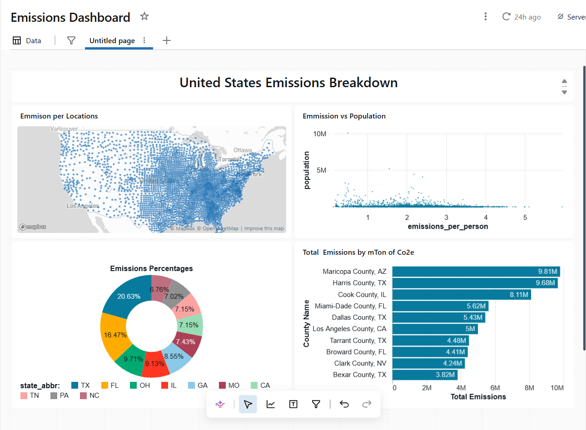

# Databricks Big Data Emissions Dashboard

This repository contains the configuration, architecture, and data queries for an interactive **Emissions Analytics Dashboard** built natively inside Databricks using big data workflows.

## 📊 Project Overview
The goal of this project was to ingest, clean, and visualize large-scale global emissions datasets to discover actionable trends regarding carbon outputs across different industries and geographic regions.

### 📈 Dashboard Preview

## 🛠️ Tech Stack & Tools
* **Platform:** Databricks (Lakehouse Architecture)
* **Languages:** PySpark, Spark SQL, Python
* **File Included:** `Emissions Dashboard.lvdash` (The complete native Databricks dashboard export asset containing layout definitions and data queries)

## 💡 Key Features Implemented
* **Data Processing:** Cleaned and transformed raw, multi-million-row emission logs using Spark SQL to filter out anomalies and handle missing variables.
* **Aggregations & KPIs:** Calculated rolling averages, year-over-year percentage variations, and country-specific totals.
* **Interactive Filtering:** Designed dynamic parameters allowing end-users to drill down by specific years, sectors, and greenhouse gas types.

---

### How to Import This Dashboard Back Into Databricks:
If you want to view or run this dashboard in your own Databricks workspace:
1. Open your Databricks workspace.
2. Navigate to **Dashboards** via the left sidebar.
3. Click **Create Dashboard** dropdown -> select **Import from file**.
4. Upload the `Emissions Dashboard.lvdash` file from this repository.
