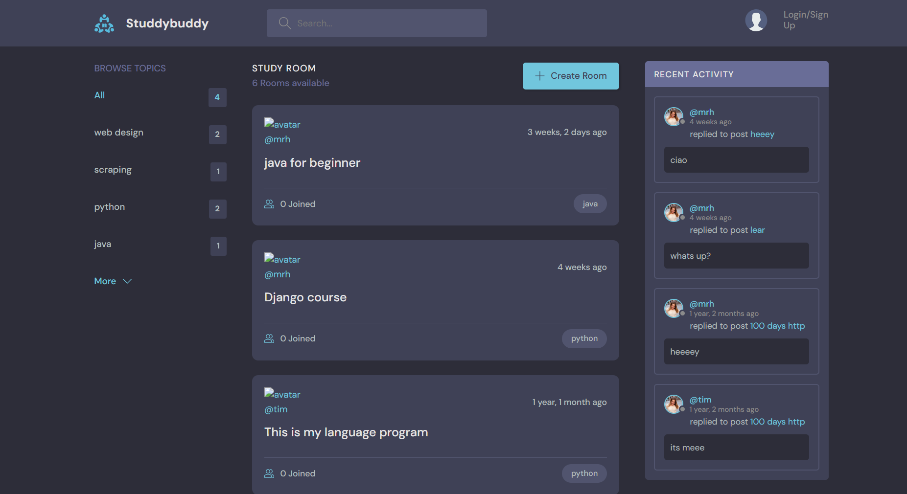

# 🤝 StudyBuddy - Learning Management & Social Platform

StudyBuddy is a comprehensive Django-based social platform designed for students and developers to create study rooms, discuss topics, and share resources in real-time.

## 🚀 Features

*   **Custom User Models:** Personalized user accounts with custom avatars and profiles.
*   **Study Rooms (CRUD):** Users can create, view, update, and delete study rooms focused on specific topics like Python, JavaScript, or Web Design.
*   **Real-time Chat:** Engage in discussions within rooms with a fully functional messaging system.
*   **Activity Feed:** Stay updated with the latest replies and room creations across the platform.
*   **Topic Browsing:** Easily filter rooms by categories to find exactly what you want to learn.
*   **Secure Authentication:** Complete user registration, login/logout flow, and restricted page access.
*   **Responsive UI:** Fully optimized for mobile and desktop viewing.
*   **REST API:** Integrated Django REST Framework for programmatic data access.

## 📸 Screenshots

### Dashboard & Activity Feed
The main hub where users can browse topics and see recent community activity.


### Room Discussion
A dedicated space for users to chat and collaborate on specific subjects.


### Creating a Room
Simple and intuitive interface for starting a new study group.


## 🛠️ Tech Stack

*   **Backend:** Django (Python)
*   **API:** Django REST Framework
*   **Frontend:** HTML5, CSS3 (Custom Theme), JavaScript
*   **Database:** SQLite (Development) / PostgreSQL (Production)

## ⚙️ Installation & Setup

1.  **Clone the project:**
    ```bash
    git clone [https://github.com/Heibattttt/myWorks.git](https://github.com/Heibattttt/myWorks.git)
    ```
2.  **Create and Activate Virtual Environment:**
    ```bash
    python -m venv env
    # Windows
    .\env\Scripts\activate
    # Mac/Linux
    source env/bin/activate
    ```
3.  **Install Dependencies:**
    ```bash
    pip install django djangorestframework
