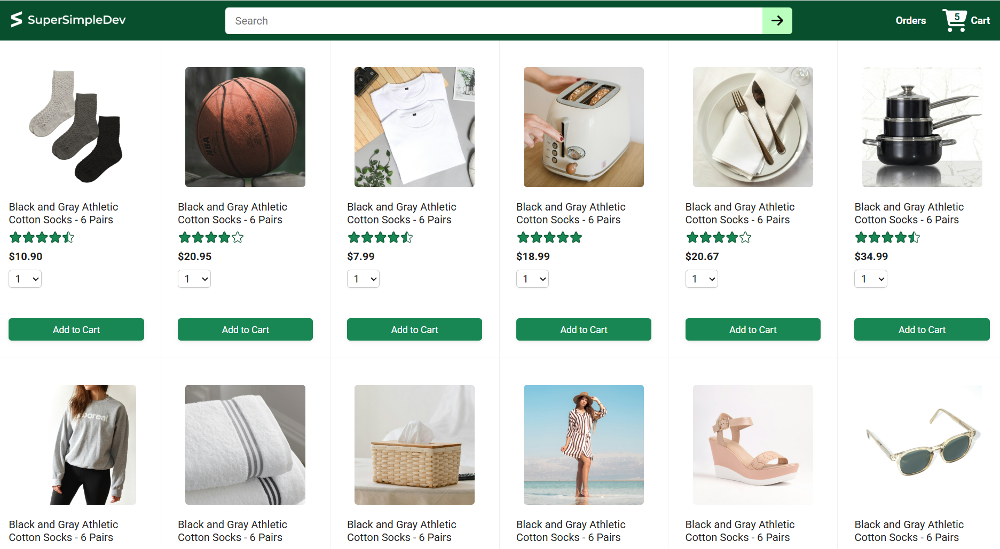
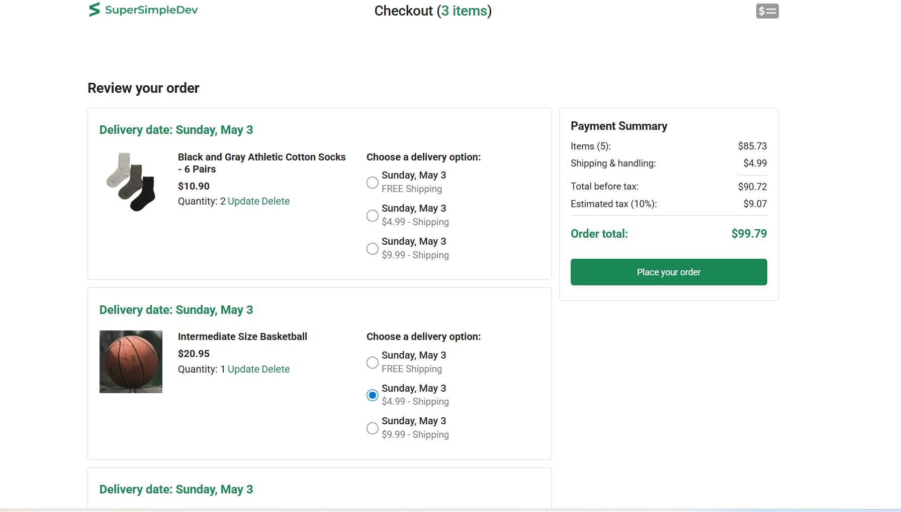
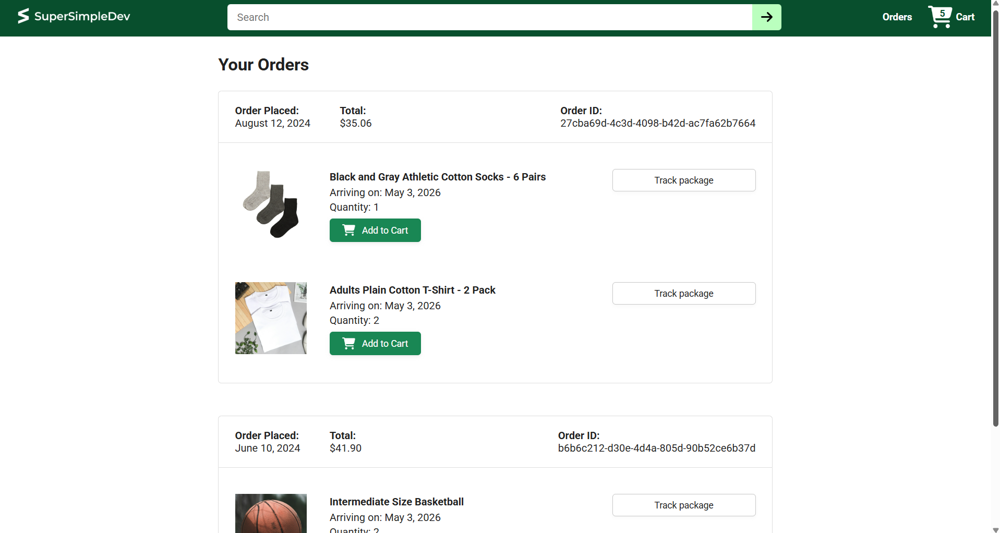

# 🛒 Amazon-Style E-Commerce Project

A fully functional e-commerce application built with **React** and **Vite**, featuring a dynamic shopping cart and real-time checkout calculations.

## 🌟 Features

*   **Product Catalog:** A clean grid layout displaying various products with price and star ratings.
*   **Interactive Cart:** Users can select quantities and add items to their cart directly from the home page.
*   **Smart Checkout:** A detailed review page where users can update quantities, delete items, and choose between different delivery options.
*   **Order Summary:** Real-time calculation of items, shipping, and a **10% estimated tax**.
*   **Order History:** A dedicated page to track past orders, including Order IDs and delivery dates.

## 📸 Project Previews

### Main Storefront
The home page features a searchable product list with "Add to Cart" functionality.


### Checkout Logic
The checkout page handles complex delivery options and price summaries.


### Tracking & Orders
Users can view their order history and track packages.


## 🛠️ Calculation Logic (Example)

The app ensures financial accuracy during the checkout process:
*   **Items Total:** Sum of all product prices multiplied by their quantity.
*   **Shipping:** Flat fees based on the user's choice (e.g., **$4.99** or **$9.99**).
*   **Tax:** **10%** calculation added to the subtotal before the final order total.
    *   *Example:* If your total before tax is **$90.72**, the app calculates an estimated tax of **$9.07** to reach a final total of **$99.79**.

## 🚀 Getting Started

1.  **Clone the Repository:**
    ```bash
    git clone [https://github.com/Heibattttt/myWorks.git](https://github.com/Heibattttt/myWorks.git)
    ```
2.  **Install Dependencies:**
    ```bash
    npm install
    ```
3.  **Run the App:**
    ```bash
    npm run dev
    ```
